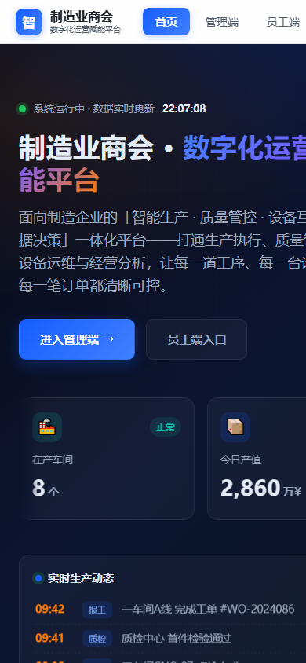

# Manufacturing Association Platform

> Digital Operations Empowerment Platform for Manufacturing Associations


[English](README.md) | [中文](README.zh.md)

## Features

### Core Features
- Industry-tailored landing for manufacturing associations & SMBs
- SEO-ready: sitemap.xml, robots.txt, semantic markup
- Privacy & legal pages included
- MIT licensed
- Drop-in static deploy on Nginx / Apache / CDN
- Optimized for fast first paint

### Technical Features
- Modern web stack: HTML5 · CSS3 · Vanilla JavaScript · Nginx/Apache
- Privacy-first: HTTPS enforced, security headers, sensitive-file isolation
- SEO-ready: `sitemap.xml`, `robots.txt`, semantic markup
- License: MIT

## Screenshots

Real screenshots captured via local server + headless Edge:

### Home page preview


### Overview flow (extended viewport)


### Mobile responsive (390x844)



---

## Quick Start

### Prerequisites
- Git
- Nginx / Apache (or any static/PHP host)
- For the static sites: any browser
- For the PHP sites: PHP 8.0+, MySQL 5.7+ or SQLite

### Installation

```bash
# Clone the repository
git clone https://gitee.com/qingyuanfanshenrengongzhineng/zhizao.qyfanshen.git
cd zhizao.qyfanshen.com

# (PHP sites only) copy the env template and fill in your values
cp .env.example .env
# edit .env
```

### Local Preview

```bash
# Static site
python -m http.server 8080

# PHP site
php -S 127.0.0.1:8080 -t .
```

Then open http://localhost:8080

## Usage Guide

1. Configure your environment (`.env` for PHP, deploy config for static).
2. For PHP sites: import the database schema and update `config/app.php` (or `api/db.php`).
3. For static sites: deploy the directory directly to Nginx / CDN.
4. Visit the homepage and verify the landing page renders.
5. (If applicable) login to `/admin/` and review the data.

## Project Structure

```
zhizao.qyfanshen.com/
├── README.md            # This file (English)
├── README.zh.md         # Chinese README
├── AGENTS.md            # AI agent collaboration notes
├── TODO.md              # Roadmap & TODOs
├── CHANGELOG.md         # Version history
├── CONTRIBUTING.md      # Contribution guide
├── LICENSE              # MIT License
├── index.html           # Entry page
├── privacy.html         # Privacy policy page
├── screenshots/         # Visual assets
│   ├── README.md
│   └── preview.png
├── docs/                # Additional documentation
│   ├── QUICKSTART.md
│   ├── ARCHITECTURE.md
│   ├── DEPLOYMENT.md

└── .github/             # Issue templates & CI workflows
    ├── ISSUE_TEMPLATE/
    ├── workflows/ci.yml
    └── PULL_REQUEST_TEMPLATE.md
```

## Architecture

See [`docs/ARCHITECTURE.md`](docs/ARCHITECTURE.md) for the system design.

## Development

- Linting / formatting per project conventions
- Run `git status` before committing
- Follow the security guidelines in `.env.example`

## Deployment

See [`docs/DEPLOYMENT.md`](docs/DEPLOYMENT.md) for production deployment steps (Nginx, Apache, Docker, or shared hosting).

## Contributing

Contributions are welcome! Please read [CONTRIBUTING.md](CONTRIBUTING.md) first. Use the [issue templates](.github/ISSUE_TEMPLATE/) and the [PR template](.github/PULL_REQUEST_TEMPLATE.md).

## License

[MIT](LICENSE) — see the LICENSE file for details.

## Acknowledgments

- Inspired by [x007xyz/flycut-caption](https://github.com/x007xyz/flycut-caption) repo style
- Built by the Fanshen Group engineering team

## Support

- Issues: please use the in-repo issue templates
- Domain: https://zhizao.qyfanshen.com
