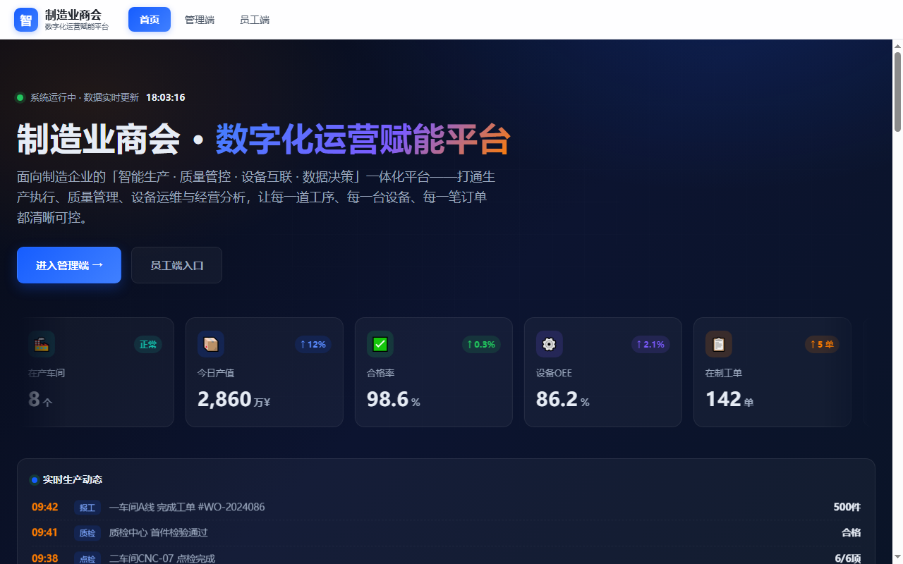
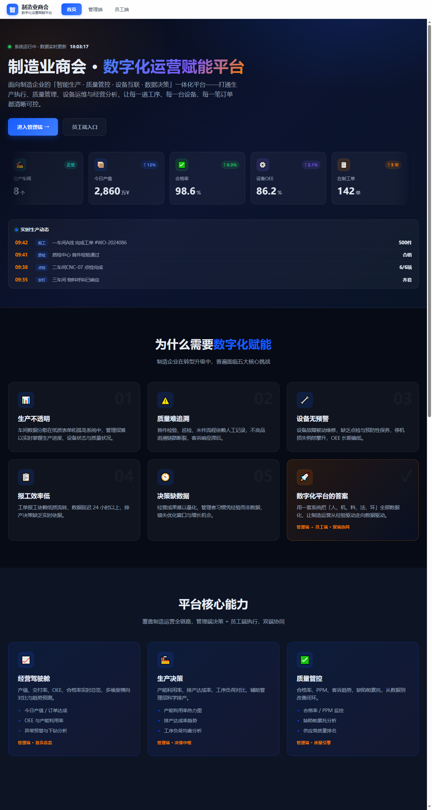

# 制造业商会 · 数字化运营赋能平台

> 制造业商会 · 数字化运营赋能平台



[English](README.md) | [中文](README.zh.md)

## 特色功能

### 核心功能
- 面向制造业商会与中小制造企业的落地站
- SEO 就绪：sitemap.xml、robots.txt、语义化标签
- 内置隐私与法律页面
- MIT 协议
- 支持 Nginx / Apache / CDN 直接静态部署
- 首屏渲染快

### 技术特性
- 现代化技术栈：HTML5 · CSS3 · Vanilla JavaScript · Nginx/Apache
- 隐私与安全：HTTPS 强制、安全响应头、敏感文件隔离
- SEO 就绪：`sitemap.xml`、`robots.txt`、语义化标签
- 许可证：MIT

## 截图预览

通过本地服务 + 无头浏览器渲染的真实截图：

### 首页预览


### 概览流程（大视口）



---

## 快速开始

### 前置要求
- Git
- Nginx / Apache（或任何静态/PHP 主机）
- 静态站：任何浏览器即可
- PHP 站：PHP 8.0+、MySQL 5.7+ 或 SQLite

### 安装步骤

```bash
# 克隆仓库
git clone https://gitee.com/qingyuanfanshenrengongzhineng/zhizao.qyfanshen.git
cd zhizao.qyfanshen.com

# （仅 PHP 站点）复制环境变量模板并填入真实值
cp .env.example .env
# 编辑 .env
```

### 本地预览

```bash
# 静态站
python -m http.server 8080

# PHP 站
php -S 127.0.0.1:8080 -t .
```

然后打开 http://localhost:8080

## 使用指南

1. 配置环境（PHP 站填写 `.env`，静态站配置部署参数）
2. PHP 站：导入数据库结构，修改 `config/app.php` 或 `api/db.php`
3. 静态站：直接将目录部署到 Nginx / CDN
4. 访问首页，确认落地页正常渲染
5. （如适用）登录 `/admin/` 检查数据

## 项目结构

```
zhizao.qyfanshen.com/
├── README.md            # 英文说明
├── README.zh.md         # 本文件（中文说明）
├── AGENTS.md            # AI 协作说明
├── TODO.md              # 路线图与待办
├── CHANGELOG.md         # 版本历史
├── CONTRIBUTING.md      # 贡献指南
├── LICENSE              # MIT 许可证
├── index.html           # 入口页
├── privacy.html         # 隐私政策页
├── screenshots/         # 视觉素材
│   ├── README.md
│   └── preview.png
├── docs/                # 补充文档
│   ├── QUICKSTART.md
│   ├── ARCHITECTURE.md
│   ├── DEPLOYMENT.md

└── .github/             # Issue 模板与 CI 工作流
    ├── ISSUE_TEMPLATE/
    ├── workflows/ci.yml
    └── PULL_REQUEST_TEMPLATE.md
```

## 架构说明

## 概述

- **项目**：制造业商会 · 数字化运营赋能平台
- **类型**：静态落地站
- **技术栈**：HTML5 · CSS3 · Vanilla JavaScript · Nginx/Apache

## 模块划分

- **前端展示层**：基于 HTML/CSS/JavaScript 单页应用，部署到 Nginx/CDN。


## 数据流

```
[Browser]
   │
   ├─── 静态资源（Nginx / CDN）
   │


   │
   └─── /admin/*（如适用）
```

## 安全设计

- HTTPS 强制（301 跳转）
- 安全响应头：CSP / X-Frame-Options / Referrer-Policy / Permissions-Policy
- 敏感文件（`.env`、`*.bak.*`、`storage/`、`.user.ini`）通过 `.gitignore` + Nginx deny 双重保护
- 接口限流（PHP 站 `api/rate_limit.php`）
- CSRF token 校验（PHP 站 `includes/csrf.php`）

## 开发指南

- 按项目约定进行 lint / format
- 提交前运行 `git status` 自检
- 遵守 `.env.example` 中的安全约定

## 部署

## 生产部署

### 1. Nginx 站点配置（推荐）

```nginx
server {
    listen 80;
    server_name zhizao.qyfanshen.com;
    return 301 https://$server_name$request_uri;
}

server {
    listen 443 ssl http2;
    server_name zhizao.qyfanshen.com;

    ssl_certificate     /etc/nginx/ssl/manufacturing-platform.crt;
    ssl_certificate_key /etc/nginx/ssl/manufacturing-platform.key;

    root /var/www/zhizao.qyfanshen.com;
    index index.html index.php;

    # 安全头
    add_header X-Frame-Options "SAMEORIGIN" always;
    add_header X-Content-Type-Options "nosniff" always;
    add_header Referrer-Policy "strict-origin-when-cross-origin" always;
    add_header Permissions-Policy "geolocation=(), microphone=(), camera=()" always;

    # 静态资源缓存
    location ~* \.(css|js|jpg|jpeg|png|gif|svg|woff2?)$ {
        expires 7d;
        add_header Cache-Control "public, max-age=604800, immutable";
    }

    

    # 禁止访问敏感文件
    location ~ /(\.env|\.user\.ini|\.htaccess|\.bak\.|composer\.json|composer\.lock|package\.json|\.git) {
        deny all;
        return 404;
    }
}
```

### 2. Apache `.htaccess`

```apache
RewriteEngine On
RewriteCond %{HTTPS} !=on
RewriteRule ^(.*)$ https://%{HTTP_HOST}%{REQUEST_URI} [L,R=301]

<IfModule mod_headers.c>
    Header set X-Frame-Options "SAMEORIGIN"
    Header set X-Content-Type-Options "nosniff"
    Header set Referrer-Policy "strict-origin-when-cross-origin"
</IfModule>

<FilesMatch "\.(env|user\.ini|htaccess|bak\.|gitignore)$">
    Require all denied
</FilesMatch>
```

### 3. Docker（仅 Next.js）

```dockerfile
FROM node:22-alpine AS build
WORKDIR /app
COPY package*.json ./
RUN npm ci
COPY . .
RUN npm run build

FROM node:22-alpine
WORKDIR /app
COPY --from=build /app/.next ./.next
COPY --from=build /app/public ./public
COPY --from=build /app/package*.json ./
RUN npm ci --omit=dev
EXPOSE 3000
CMD ["npm", "start"]
```

### 4. 部署后检查清单

- [ ] HTTPS 已生效（浏览器锁图标）
- [ ] `https://https://zhizao.qyfanshen.com/.env` 返回 404
- [ ] 安全响应头可在 https://securityheaders.com 验证为 A 或 A+
- [ ] sitemap.xml 可访问
- [ ] robots.txt 可访问
- [ ] 隐私页 `privacy.html` 可访问

## 贡献

欢迎贡献！请先阅读 [CONTRIBUTING.md](CONTRIBUTING.md)，并使用 [issue 模板](.github/ISSUE_TEMPLATE/) 与 [PR 模板](.github/PULL_REQUEST_TEMPLATE.md)。

## 许可证

本项目基于 **MIT 许可证** 开源。

**允许：**
- ✅ 商业使用
- ✅ 修改
- ✅ 分发
- ✅ 再授权
- ✅ 私人使用

**条件：**
- 📄 在软件副本中必须包含原始版权声明和许可证声明

**完整条款：** 详见 [LICENSE](LICENSE) 文件。

## 致谢

- 仓库样式参考 [x007xyz/flycut-caption](https://github.com/x007xyz/flycut-caption)
- 由梵燊集团工程团队构建

## 支持

- 问题反馈：请使用仓库内的 issue 模板
- 站点域名：https://zhizao.qyfanshen.com

## 联系我们

扫码添加企业微信，获取技术支持、商务咨询或合作洽谈：


其他联系方式：
- 集团主站：<https://qyfanshen.com>
- 问题反馈：请使用仓库内的 issue 模板
